# HeidiSQL/ReidiSQL 基本帮助文档

本文档旨在为用户提供开始使用 HeidiSQL/ReidiSQL 的基本帮助。多年来，功能列表不断增加。因此，尤其是新用户有时不知道在哪里查找特定功能。在这种情况下，您可以在这里查看首次帮助。如果您没有找到所需内容，请在[论坛](https://www.heidisql.com/forum.php)注册并发布问题。

## 目录

- [系统要求](#系统要求)
- [连接到服务器](#连接到服务器)
- [命令行参数](#命令行参数)
- [数据库树](#数据库树)
- [创建视图](#创建视图)
- [执行 SQL 查询](#执行-sql-查询)
- [HeidiSQL 便携版](#heidisql-便携版)
- [许可证](#许可证)

---

## 系统要求

HeidiSQL/ReidiSQL 可在 Windows 11（以及 Windows 7 + 8 + 10，偶有小问题）上正常运行。在 Wine 上运行 HeidiSQL 目前相当不稳定。如果您通过 Wine 遇到问题，原生 Linux 版本可能是您的替代选择。

安装 HeidiSQL/ReidiSQL 的常规方式是从[下载页面](https://www.heidisql.com/download.php)下载发布安装程序。安装后，您可以通过下载页面直接下载每日构建版本，也可以通过 HeidiSQL/ReidiSQL 本身（关于 > 检查更新）下载。

---

## 连接到服务器

### 基本信息

HeidiSQL/ReidiSQL 是一个所谓的*客户端*应用程序，只有在您有可用的*服务器*时才能使用。因此，请确保您有要连接的 MariaDB、MySQL、MS SQL、PostgreSQL 服务器或 SQLite 数据库文件。

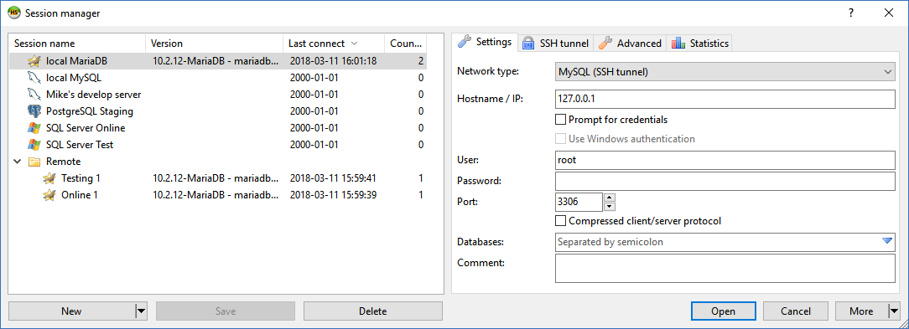

一个简单的设置是在 *localhost*（等同于特殊 IP 地址 *127.0.0.1*）上安装一个 [MariaDB](https://mariadb.com/) 服务器。在 HeidiSQL/ReidiSQL 的会话管理器中，点击"新建"按钮创建一个新连接，大多数默认设置已经为您设置好了，除了密码——新安装的 MariaDB 服务器上的密码通常不是空的。

**提示输入凭据**

每次连接到此会话时都会提示输入用户名和密码

**使用 Windows 身份验证**

用户名和密码将从您当前的 Windows 会话获取并用于服务器连接。仅在 MySQL、MariaDB 和 MS SQL 上可用。

**加密**

仅限 SQLite：通过右侧的下拉箭头选择支持的加密算法，例如 "*rc4*"（"*System.Data.SQLite*" 的别名）。然后您需要在"密钥"字段中提供主数据库的密钥。

**压缩客户端/服务器协议**

压缩 HeidiSQL/ReidiSQL 与服务器之间的流量。仅在网络带宽较低或结果集较大时推荐使用。仅在 MySQL 和 MariaDB 上可用。

**数据库**

如果为空，HeidiSQL/ReidiSQL 会显示您有权访问的所有数据库。您可以通过在此设置中仅输入您想显示的数据库名称来限制数据库树。

**加密参数**

仅限 SQLite：配置加密参数，格式为 "*param1=1;param2=200;...*"。有关支持的参数值对，请参见[支持的加密算法](https://utelle.github.io/SQLite3MultipleCiphers/docs/ciphers/cipher_overview/)页面。

**注释**

您喜欢的任何文本或备注。左侧的会话列表可以在列中显示此注释。

您可以将存储的会话组织到文件夹中。要创建文件夹，请点击"新建"按钮上的下拉箭头，然后点击"根文件夹中的文件夹"或"所选文件夹中的文件夹"。一旦您有了文件夹，就可以在其中创建连接，或将现有连接拖入该文件夹。

### 函数库

HeidiSQL/ReidiSQL 需要特定于数据库的动态库来连接到您的服务器。例如，访问 MySQL 服务器需要您安装 *libmysql.dll* 或 *libmariadb.dll*。Windows 安装程序附带您可能需要的所有必需函数库。

但是，HeidiSQL/ReidiSQL 的 Linux 版本不附带这些函数库。因此，需要通过 .deb 包依赖项安装，或者手动安装，例如：

```bash
sudo apt-get install libmysqlclient-dev
sudo apt-get install libmariadb-dev
sudo apt-get install libpq5
sudo apt-get install libsqlite3-dev
```

### 设置到 MariaDB/MySQL/PostgreSQL 的 SSH 隧道连接

如果您的 MariaDB/MySQL/PostgreSQL 服务器位于远程机器上，只能通过 SSH 访问，那么您仍然可以使用 HeidiSQL/ReidiSQL 连接它。HeidiSQL/ReidiSQL 安装程序将 plink.exe 放置在正确的文件夹中，因此您只需从下拉菜单中选择它。在更新版本中，您可以使用 "ssh.exe" 作为替代方案，这是 Microsoft 的 OpenSSH 实现。在这两种情况下，您都需要告诉 HeidiSQL/ReidiSQL SSH 凭据以及 MariaDB/MySQL/PostgreSQL/MSSQL 凭据。

请注意，SSH 服务器的默认主机名是您在"设置"选项卡中输入的主机名。HeidiSQL/ReidiSQL 随后建议 plink.exe 连接到该主机名，或者当您输入了 SSH 主机名时，则使用该主机名。此外，"设置"选项卡上的主机名始终用于 plink.exe 中的 -L（监听）选项。

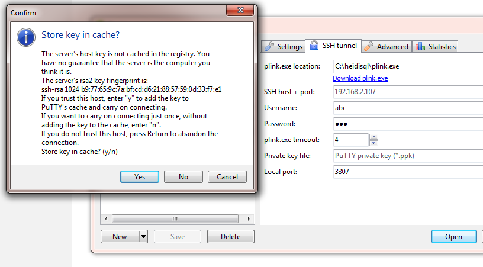

设置示例：

- "设置"选项卡：
  - 主机名/IP："127.0.0.1"
  - 密码：[您的 mysql 密码]
  - 端口：大多数情况下为 "3306"

- "SSH 隧道"选项卡：
  - SSH 主机：[您的服务器名称]
  - 端口：大多数情况下为 "22"
  - 用户名：[您的 ssh 用户]
  - 密码：[您的 ssh 密码]
  - 本地端口："3307"

以下错误或类似错误主要是由隧道到远程服务器的官方 IP 地址引起的：

```
Lost connection to MySQL server at 'reading initial communication packet', system error: 0 "Internal error/check (Not system error)"
```

在这种情况下，请确保在 *设置 > 主机名/IP* 中使用 "127.0.0.1"，在 *SSH 隧道 > 主机* 中使用您服务器的远程 IP。

---

## 命令行参数

虽然 HeidiSQL/ReidiSQL 是一个纯 GUI 应用程序，但可以通过命令行参数实现连接和打开文件的自动化。参数名称区分大小写，基于 MariaDB/MySQL 命令行应用程序使用的参数，例如 mysqldump。

常见陷阱：

- 确保使用完整文件名调用 HeidiSQL/ReidiSQL（"heidisql.exe"），而不是简短版本（"heidisql"）。HeidiSQL/ReidiSQL 的命令行解析器期望这种方式。这将在未来修复。
- 参数键可以用 *=* 或一个空格与其值分隔，例如 *-h=localhost*
- 包含点的参数必须用双引号包装。在传递 IP 地址时这很重要：*-h=192.168.1.1* 将只使用第一段 *192*，而 *-h="192.168.1.1"* 是正确的形式。

| 短参数 | 长参数 | 描述 | 默认值 |
|--------|--------|------|--------|
| | Session name | 会话名称 | |
| -n | | 网络协议类型：<br>0 = MariaDB/MySQL (TCP/IP)<br>1 = MariaDB/MySQL (命名管道)<br>2 = MariaDB/MySQL (SSH 隧道)<br>3 = MSSQL (命名管道)<br>4 = MSSQL (TCP/IP)<br>5 = MSSQL (SPX/IPX)<br>6 = MSSQL (Banyan VINES)<br>7 = MSSQL (Windows RPC)<br>8 = PostgreSQL (TCP/IP)<br>9 = PostgreSQL (SSH 隧道)<br>10 = SQLite<br>11 = ProxySQL Admin<br>12 = Interbase (TCP/IP)<br>13 = Interbase (本地)<br>14 = Firebird (TCP/IP)<br>15 = Firebird (本地)<br>16 = MySQL on RDS<br>17 = SQLite (加密) | 0 |
| -h | Host name | 主机名 | |
| -l | Library | 函数库或提供程序（v11.1 添加）：<br><br>**MySQL/MariaDB:**<br>libmariadb.dll<br>libmysql.dll<br>libmysql-6.1.dll<br>... 您的 HeidiSQL 目录中任何合适的 dll<br><br>**MS SQL:**<br>MSOLEDBSQL<br>SQLOLEDB<br><br>**PostgreSQL:**<br>libpq.dll<br>libpq-12.dll<br>... 您的 HeidiSQL 目录中任何合适的 dll<br><br>**SQLite:**<br>sqlite3.dll<br>... 您的 HeidiSQL 目录中任何合适的 dll<br><br>**Interbase:**<br>ibclient64-14.1.dll<br>gds32-14.1.dll<br>... 您的 HeidiSQL 目录中任何合适的 dll<br><br>**Firebird:**<br>fbclient-4.0.dll<br>... 您的 HeidiSQL 目录中任何合适的 dll | 取决于给定的网络协议，参见带下划线的值 |
| -u | User name | 用户名 | |
| -p | Password | 密码 | |
| -P | Port | MySQL/MariaDB: 3306<br>MS SQL: 0 (由驱动自动检测，之前为 1433)<br>PostgreSQL: 5432<br>SQLite: 无值<br>Interbase/Firebird: 3050 | |
| -s | Socket name | 套接字名称，用于命名管道连接 | |
| -d | Database | 数据库，用分号分隔。PostgreSQL 单个数据库。Interbase 和 Firebird 期望在这里使用本地文件。 | |
| -w | | 使用 Windows 身份验证：1 或 0。（仅限 MSSQL、MySQL 和 MariaDB） | 0 |
| | Enable cleartext auth | 启用明文身份验证：1 或 0。（仅限 MySQL 和 MariaDB） | 0 |
| | Use SSL | 使用 SSL。（1=是，0=否） | 0 |
| | SSL key | SSL 私钥 | |
| | SSL CA certificate | SSL CA 证书 | |
| | SSL certificate | SSL 证书 | |
| | SSL cipher | SSL 加密 | |
| | SSL verify | SSL 证书验证：<br>0=不验证<br>1=验证 CA<br>2=验证主机名 | 2 |
| | Portable settings file | 便携设置的自定义文件名。如果文件不存在则忽略。 | portable_settings.txt（如果该文件存在） |
| | SSH executable | SSH 可执行文件 - 完整路径或仅文件名 | |
| | SSH host | SSH 服务器主机 | |
| | SSH port | SSH 服务器端口 | |
| | Local port | 本地端口 | |
| | SSH user | SSH 用户名 | |
| | SSH password | SSH 用户密码 | |
| | SSH key | SSH 私钥 | |
| | SSH timeout | SSH 连接超时 | |

### 示例：

- 使用会话"xyz"中存储的设置启动：
  - `c:\path\to\heidisql.exe -d=xyz`
  - `c:\path\to\heidisql.exe -description=xyz`

- 使用不同的用户名或端口连接：
  - `c:\path\to\heidisql.exe -d=xyz -u=OtherUser`
  - `c:\path\to\heidisql.exe -d=xyz -P=3307`

- 连接到非存储会话：
  - `c:\path\to\heidisql.exe -h="127.0.0.1" -u=root -p=Mypass -P=3307`

- 在查询标签页中打开多个 .sql 文件：
  - `c:\path\to\heidisql.exe fileA.sql path\to\fileB.sql fileC.sql ...`

- 使用自定义便携设置文件：
  - `c:\path\to\heidisql.exe --psettings=c:\temp\p.txt`

---

## 数据库树

当您的数据库中有大量表、视图或其他对象时，您可能希望按类型对它们进行分组以获得更好的概览。只需右键单击树并激活**树样式选项 > 按类型分组对象**：

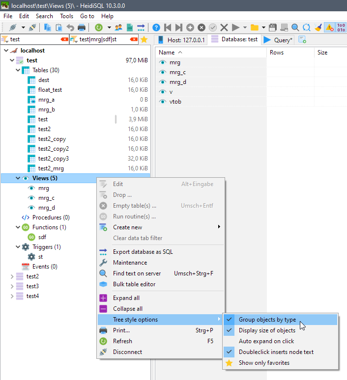

您还可以通过点击表最左侧的区域将重要项目标记为收藏。之后，您可以通过点击顶部的"仅显示收藏"按钮来限制树只显示收藏：

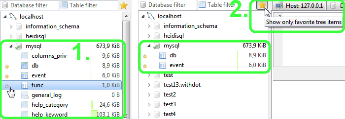

---

## 创建表

HeidiSQL/ReidiSQL 附带功能丰富的 GUI，用于创建和编辑表结构。只需右键单击要创建表的数据库，然后指向"新建"，再点击"表"：

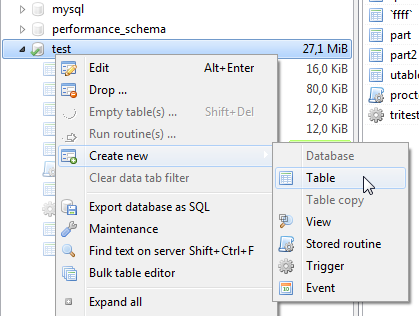

完成之后，您将看到如下图所示的表编辑器：

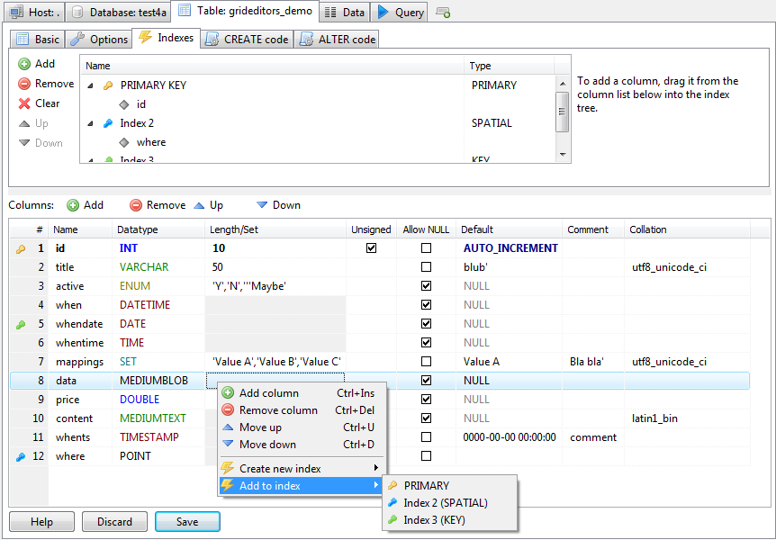

---

## 创建视图

点击"新建"，然后点击"视图"，以显示视图编辑器。创建视图基本上就是编写 SELECT 查询。为它指定一个名称，然后点击保存按钮创建它。HeidiSQL/ReidiSQL 像对待表一样在"数据"选项卡中显示视图的数据。

您可能注意到的一件事是，MySQL 和 MariaDB 在您保存时会重新格式化视图中的 SELECT 查询。这会破坏缩进，并将整个查询转换为单行。HeidiSQL/ReidiSQL 会尽力通过从服务器上的 \*.frm 文件加载来恢复视图的原始代码。但是，在许多情况下这会失败，通常是由于受限的文件权限。对于这种情况，使其再次可读的唯一方法是使用 HeidiSQL/ReidiSQL 的格式化工具（Ctrl+F8）。

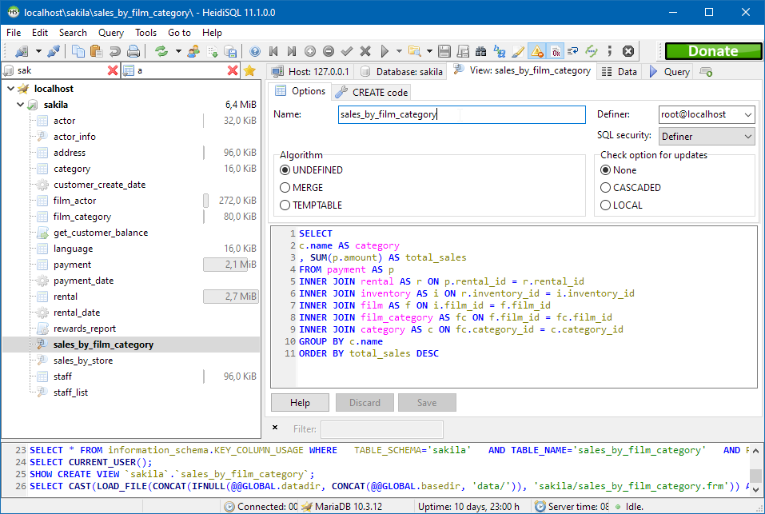

---

## 创建存储过程

只需右键单击要创建过程的数据库，然后指向"新建"，再点击"过程"或"函数"。完成之后，您将看到如下图所示的过程编辑器：

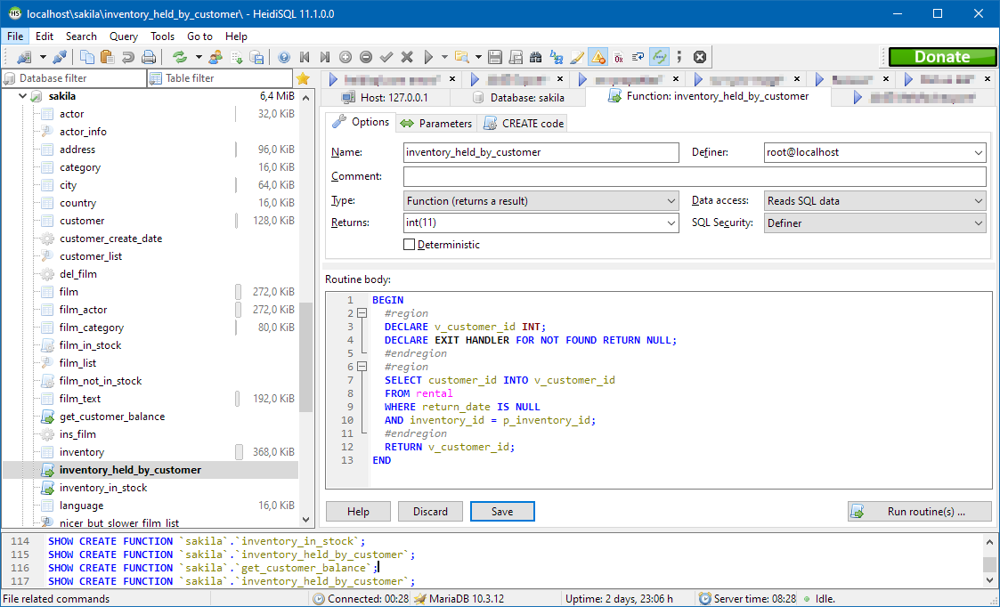

---

## 创建触发器

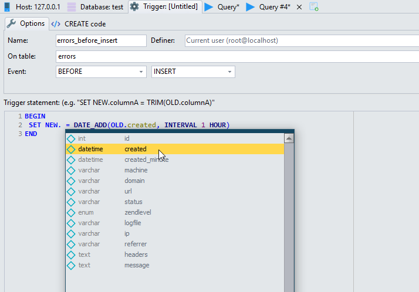

---

## 创建计划事件

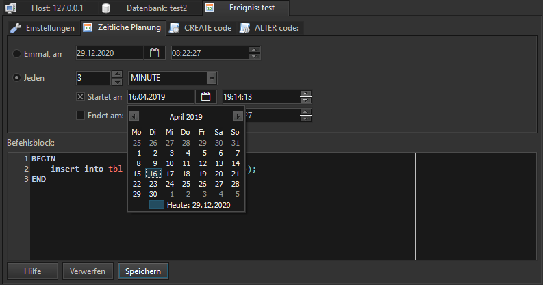

---

## 数据选项卡

在数据选项卡中，显示当前选定的表或视图的内容。这是 HeidiSQL/ReidiSQL 最有用和最强大的功能之一。您将看到不同数据类型的不同颜色。这些颜色可在**工具 > 偏好设置 > 数据外观**中自定义。

按 F2 或在网格单元格上长按将进入编辑模式。这将允许您向行中插入普通值。对于插入特殊值（如 SQL 函数、NULL 或 GUID），请右键单击单元格，然后指向**插入值 >** 子菜单。

**快速过滤器**：右键单击网格中的值，然后点击**快速过滤器**，获取各种一键选项来基于网格值创建 WHERE 子句。此过滤器可以基于网格中的焦点单元格、提示的值，或剪贴板的内容。

在**快速过滤器**子菜单中，您会发现一个**更多值**子子菜单。指向该菜单，HeidiSQL/ReidiSQL 会快速收集并显示焦点列中的前 30 个项目，按其值分组：

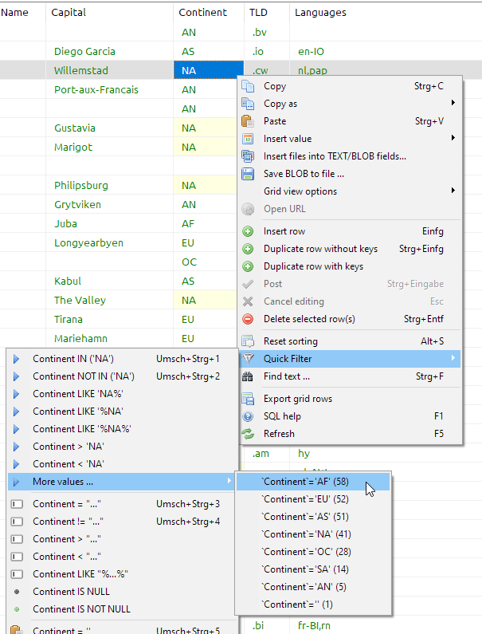

在这样的网格中查找特定值可能很痛苦。对于简单的客户端过滤器，您可以在过滤器面板中输入一些值。在**编辑 > 过滤器面板**（Ctrl+Alt+F）中激活它：

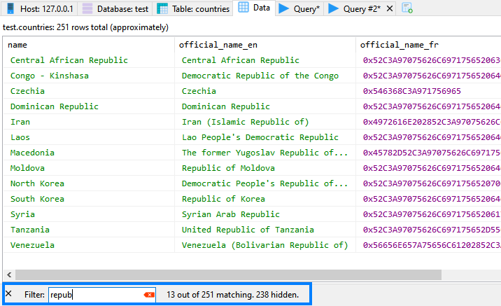

HeidiSQL/ReidiSQL 还可以帮助您使用**搜索和替换**对话框（查找模式：Ctrl+F，替换模式：Ctrl+R）。该对话框也可用于 SQL 查询标签页。

默认情况下，二进制值（也称为 BLOBs）以十六进制格式显示。

---

## HeidiSQL 便携版

HeidiSQL/ReidiSQL 可以作为便携应用程序运行，无需安装。这意味着您可以将 HeidiSQL/ReidiSQL 放在 USB 驱动器上，并在任何 Windows 计算机上使用它，而无需管理员权限或安装。

要使用便携模式，只需将 `portable_settings.txt` 文件放在与 `heidisql.exe` 相同的目录中。此文件将存储您的会话设置和其他偏好设置，而不是将它们写入 Windows 注册表。

或者，您可以使用命令行参数指定自定义便携设置文件：
```
heidisql.exe --psettings=my_settings.txt
```

---

## 许可证

HeidiSQL/ReidiSQL 是开源软件，根据 GNU General Public License (GPL) 版本 2 或更高版本许可。这意味着您可以自由使用、修改和分发该软件，但您必须遵守 GPL 的条款。

有关详细信息，请参阅 [LICENSE](https://github.com/HeidiSQL/HeidiSQL/blob/master/LICENSE) 文件。

---

## 获取更多帮助

- [在线帮助](https://www.heidisql.com/help.php)
- [论坛](https://www.heidisql.com/forum.php)
- [问题跟踪器](https://github.com/HeidiSQL/HeidiSQL/issues)
- [功能请求](https://github.com/HeidiSQL/HeidiSQL/issues/new?labels=enhancement)

---

*本文档翻译自 [HeidiSQL Help Page](https://www.heidisql.com/help.php)，适用于 HeidiSQL 及 ReidiSQL。*
